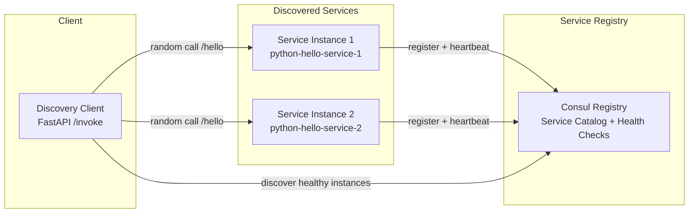
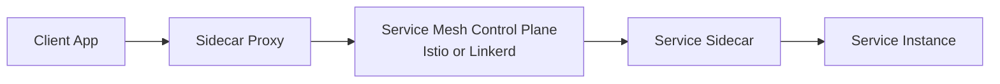

# Architecture Diagram

```mermaid
flowchart LR
    subgraph ClientSide[Client]
        C[Discovery Client\nFastAPI /invoke]
    end

    subgraph Registry[Service Registry]
        R[Consul Registry\nService Catalog + Health Checks]
    end

    subgraph Services[Discovered Services]
        S1[Service Instance 1\npython-hello-service-1]
        S2[Service Instance 2\npython-hello-service-2]
    end

    S1 -->|register + heartbeat| R
    S2 -->|register + heartbeat| R
    C -->|discover healthy instances| R
    C -->|random call /hello| S1
    C -->|random call /hello| S2
```

## Optional Service Mesh Path

```mermaid
flowchart LR
    A[Client App] --> SP1[Sidecar Proxy]
    SP1 --> M[Service Mesh Control Plane\nIstio or Linkerd]
    M --> SP2[Service Sidecar]
    SP2 --> B[Service Instance]
```
